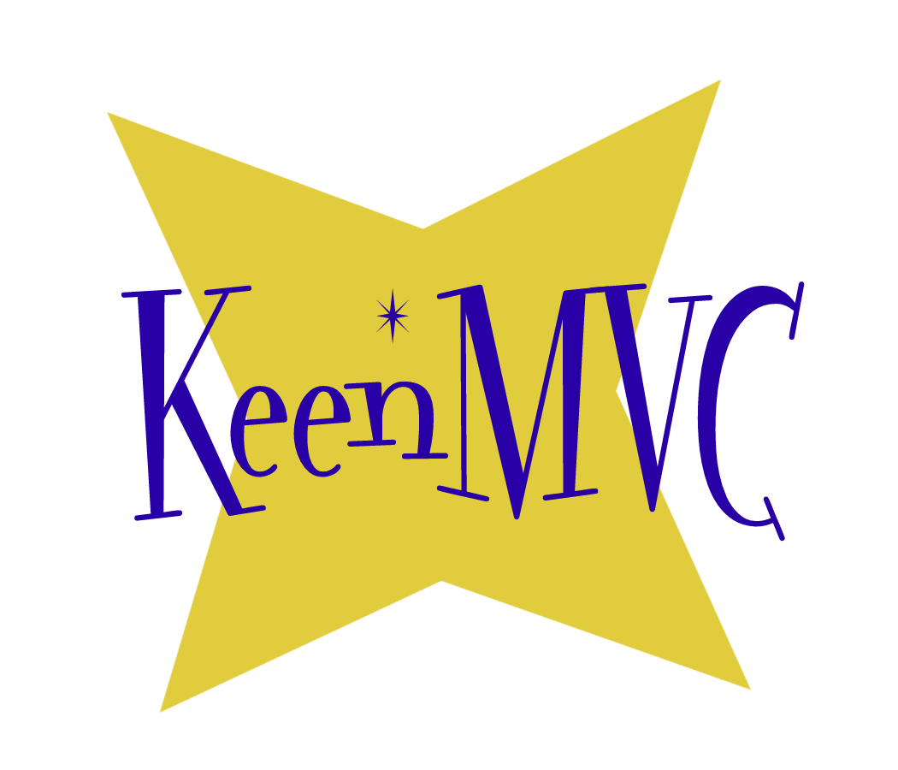

**Keen** was born from my search for an MVC framework written in PHP with all the **_good_** bits.  What are the good bits?  Here's my take (YMMV):

* Fast, Flexible, Powerful
* Inferred Models -- this one isn't too hard to find
* Lightweight -- it's so easy to go too feature-heavy
* Easy for Newcomers -- we've all been there
* View / Controller Separation  -- this one I couldn't find

The last one was the key. I wanted to be able to take an unmodified HTML file and plug it in. No templating languages. No inserting bits of PHP. A view is just a view.